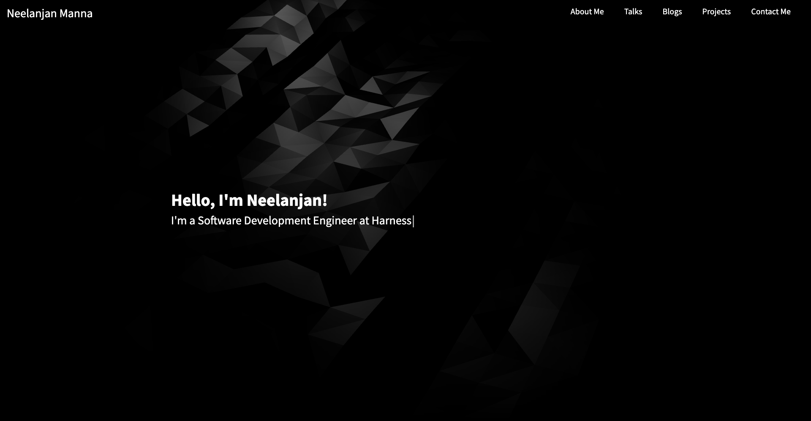

<h1 align="center">Welcome to Portfolio App 👋</h1>
<p>
  
  <a href="https://twitter.com/NeelanjanManna" target="_blank">
    
  </a>
</p>

> A portfolio application developed using Next.JS and Contentful that makes use of Static Site Generation with Incremental Site Regeneration. Displays my Projects, Blogs, Talks and other professional details.

### 🏠 [Homepage](https://github.com/neelanjan00/portfolio-next)

### ✨ [Demo](https://neelanjan.dev/)

## Install

```sh
npm install
```

## Usage

```sh
npm run dev
```

## Author

👤 **Neelanjan Manna**

* Website: https://neelanjan.dev/
* Twitter: [@NeelanjanManna](https://twitter.com/NeelanjanManna)
* Github: [@neelanjan00](https://github.com/neelanjan00)
* LinkedIn: [@neelanjan00](https://linkedin.com/in/neelanjan00)

## Show your support

Give a ⭐️ if this project helped you!
